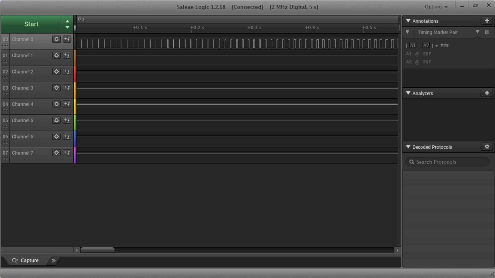
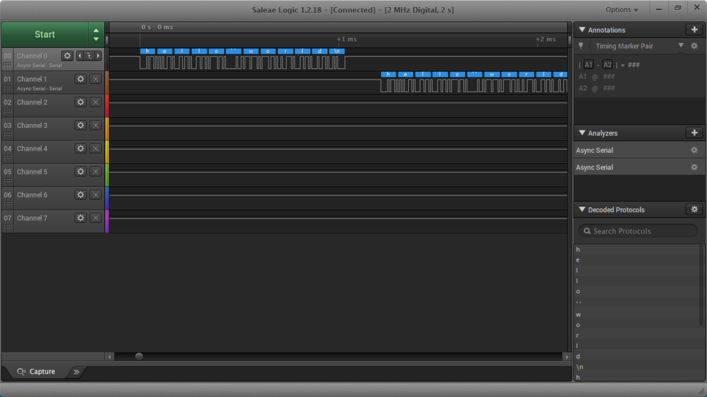

Name: Johanna McCormack

EID: jrm7853

Team Number: F1

## Questions

1. Why does your program need a setup and a loop?

    The loop needs to be able to run repeatedly, unlike setup. If setup ran every time, at best it would be slow and inefficient and at worst it would ruin the program's function.

2. What is the downside to putting all your code in a loop?

    Some lines may run more times than needed, which isn't efficient and wastes power.

3. Why does your code need to be compiled?

    I'm writing in C, which the computer doesn't understand as written. The compiler (and built in assembler) will turn my C code into assembly code and then into machine code so that the computer can actually understand what I've written.

4. When lowering the frequency in procedure A, step 4, what is going wrong? Brainstorm some solutions. Dimmers exist in the real world. What is their solution?

    As the frequency is lowered, the flicker becomes more evident. Instead of the on-off pattern "dimming" the light, it visibly turns on and off at the same brightness. Dimmers in the real world will operate at a constant frequency but with different duty cycles, so you can't visibly see the flicker and the lower duty cycles are less bright.

5. Why do you need to connect the logic analyzer ground to the ESP32 ground?

    your answer here

6. What is the difference between synchronous and asynchronous communication?

    Synchronous transmissions are based off of a shared clock signal, happening in real time. Asynchronous communication is not real time, but sends certain signals to show when the data starts/stops.

7. Profile of UART: Sent X bytes in Y time 

   1.031 ms for 12 bytes

8. Profile of SPI: Sent X bytes in Y time

    .324 ms for 12 bytes

9. Why is SPI so much faster than UART?

    SPI is synchronous and doesn't have to wait for a start bit because it functions with a clock and a chip enable signal
    
10. list one pro and one con of UART

    PRO: UART doesn't require a clock bit
    CON: UART can't have multiple master/slave devices
    
11. list one pro and one con of SPI

    PRO: Faster than UART and I2C
    CON: Gets complicated with many devices

12. list one pro and one con of I2C

    PRO: Simplest with many slave devices
    CON: Slower than SPI

13. Why does I2C need external resistors to work?

    The lines in I2C are open drain, so they need to have external resistors (pull up or pull down) to work properly.

## Screenshots

Procedure A, step 1:

Procedure A, step 4:

Procedure A, step 7:

Procedure B, UART:

Procedure B, SPI:

